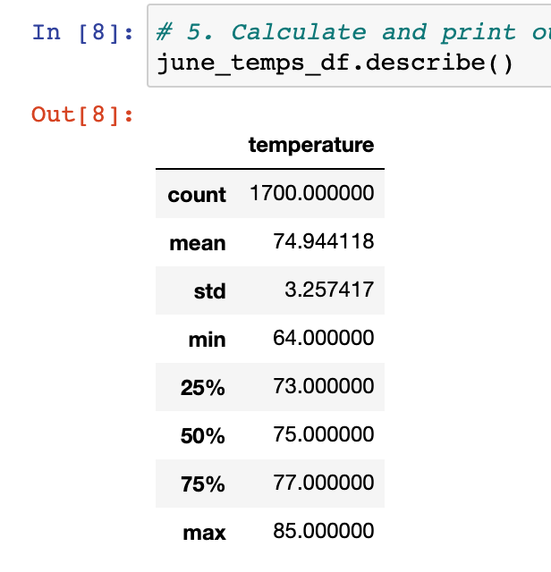

# surfs_up
## Overview
After visiting Hawaii, I was inspired to move there and open a surf n' shake shop. In order to do this, I hired the help of a very experienced investor who presented a concern about the role weather could potentially play in my business' profitability. He has tasked me with performing some analysis on the weather in Hawaii. In order to evaluate the effect of weather I have chosen to focus on June and December as they would be considered Summer and Winter months. In order to complete this analysis I learned how to utilize SQLAlchemy. 
## Results
Three key differences in weather between June and Decemeber:
* The mean temperature in June is 74.94 degrees, while the mean temperature in December is 71.04. This means that on average the daily temperature is about 3.9 degrees warmer in June than in it is in December. 
* In June the minimum temperature was 64 degrees while the minimum temperature in December was 56 degrees. The coldest day in June is still 12 degrees warmer than the coldest day in September. 
* The maximum temperature in June is 85 while the maximum temperature in December is 83 degrees. The difference in these temperatures is only 2 degrees. 
The below image is a breakdown of June Temperature stats

The below image is a breakdown of December Temperature stats

## Summary 
While there were some key differences in the temperatures for June and December they were relatively close. Additionally, the temperatures in December do not indicate the need to shut down. However, there is another weather variable that I decided to look at to present to my investor to help determine if my shop could remain open in the winter. I performed a query to analyze precipitation as rainy days are likely to bring in less business regardless of the temperature outside. See below images for the precipitation stats for the months of June and December. 
### June data

### December Data

